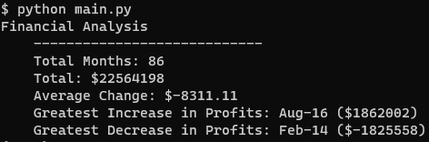
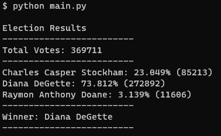

## Financial Analysis and Vote Counting in Python

Development on this project has stopped

- [Description](#description)
- [Usage](#usage)
- [Acknowledgements](#acknowledgements)
- [Author](#author)

## Description

Two different scripts, PyBank and PyPoll.

PyBank analyzes budget_data.csv, containing financial records for a company, and returns the total number of months available, total profits over time, average monthly change in profits/losses, and greatest monthly % increase in profits (with month) and decrease in losses (with month).

PyPoll analyzes election_data.csv, containing voting data for an election in a small town, and returns the total number of votes, the winnner of the election, and a list of each candidate's performance, including name, % of votes won, and number of votes won.

Both PyBank and PyPoll print out the results to the terminal, and write those same results to a basic .txt file in subfolder analysis.

## Usage

Run each program from the command line or an IDE like VS Code. Terminal output should look like this:

PyBank:

PyPoll:

## Acknowledgments

Thanks to Geronimo Perez for feedback and assistance

## Author

Bryan Johns, June, 2023
